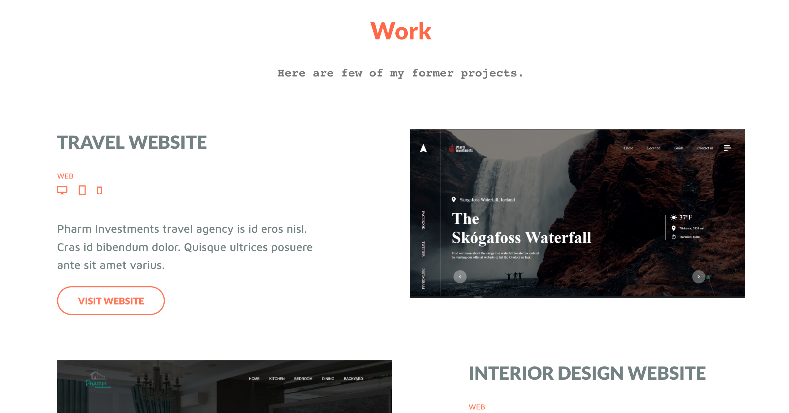

# My Portfolio
> ### 
 A Small Preview into my Portfolio page 

 
 

# Built With 🛠

<ul>
    <li>HTML</li>
    <li>CSS</li>
    <li>JAVASCRIPT</li>
    <li>BOOTSTRAP</li>
</ul>

 
 

# Live Demo 📺

You can check out the live Demo here:
<a href="https://henryanthonyy.github.io/my-portfolio/">MyPortfolio</a>
 
 

# Environments used

<ul>
    <li>VScode</li>
    <li>Web Browser</li>
</ul>

 
 

# 👨🏾‍💻 Author: Henry Anthony

<ul>
    <li>Twitter: <a href="https://twitter.com/henryk_anthony">@henryk_anthony</a></li>
    <li>Linkedin: <a href="https://www.linkedin.com/in/henry-anthony-3a3816224">@henryanthony</a></li>
    <li>Gmail: <a href="mailto:henrymeiv363@gmail.com">@henrymeiv363@gmail.com</a></li>
</ul>
